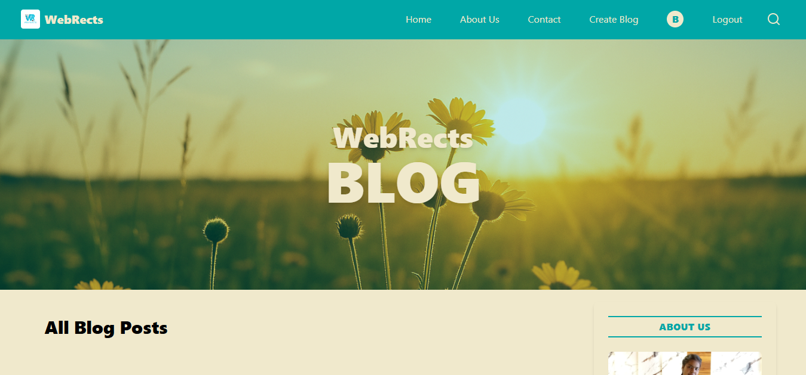
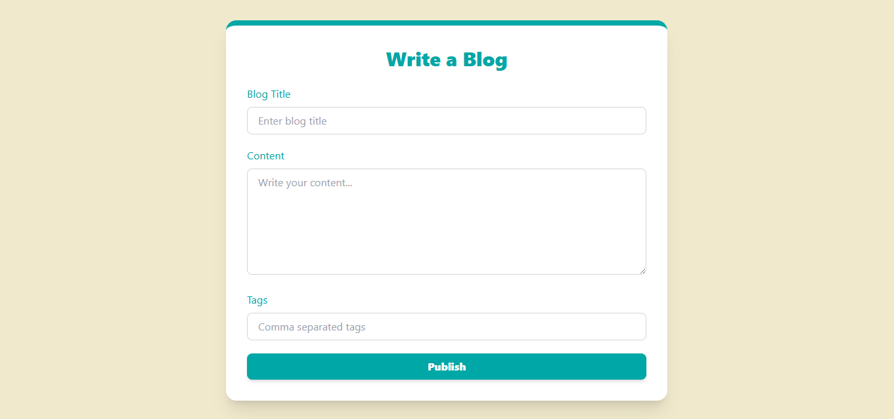

# 🎯 WebRects

**Your words, your space**  
A Blog App using HTML, CSS, JavaScript and TypeScript. Click, Express, Engage, Inspire!

🚀 **Live Demo**: [Insert your WebRects live URL if available]

---

## ✨ Features
- 📝 Create Posts – Add blog posts with a title, content, and optional images.
- 📖 Read Posts – Display posts on the homepage and single post page.
- ✏️ Edit Posts – Update existing blog entries.
- ❌ Delete Posts – Remove posts you no longer need.
---

## 🛠️ Built With
- HTML5 Canvas  
- CSS3  
- JavaScript (ES6)
- TypeScript

---

## 📸 Preview
  
  

> _“From thoughts to the world—one post at a time.”_

---

## 📁 Project Setup
Clone the repo and launch the app in your browser:

```bash
git clone https://github.com/CodeByBhumika/WebRects.git
cd WebRects
open index.html
